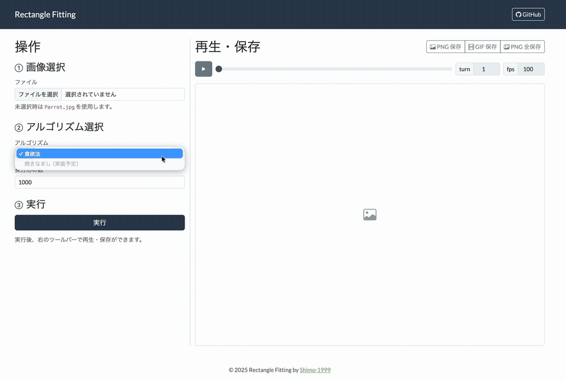

# Rectangle Fitting

画像を指定した数の非重複の長方形に隙間なく分割するアルゴリズムの実装と、その様子を可視化する Web アプリです。

| 元画像                                                             | 貪欲法の可視化アニメーション                                   |
| ------------------------------------------------------------------ | -------------------------------------------------------------- |
|  |  |

## 使い方

- デモ（GitHub Pages）：**[https://shimo-1999.github.io/rectangle-fitting/](https://shimo-1999.github.io/rectangle-fitting/)**

<p align="center">
  
</p>

1. 上のデモページにアクセスします。
2. 左パネルで **画像** を選択し、**長方形の数** を入力します。
3. **実行** を押します（画像未選択時は `Parrot.jpg` で実行）。
4. 右パネルで **再生**／**PNG 保存**／**GIF 保存**／**PNG 全保存（ZIP）** が利用できます。

> **注意**
> 細かい長方形が多い場合、GIF はチラつくことがあります。高品質な動画を共有したい場合は **PNG 全保存 → ffmpeg で MP4 化**がおすすめです。

## アルゴリズム開発

アルゴリズムは **Rust（Wasm）** で実装しています。

### 実装インターフェース

以下のような関数を実装すれば、それを可視化できます。

- **引数**：`width: usize`, `height: usize`, `rgb_data: &[u8]`（サイズは `width * height * 3`）
- **戻り値**：`Vec<Vec<Rect>>`（各ステップの長方形リスト）

```rust
pub struct Rect {
    pub x1: u16,
    pub y1: u16,
    pub x2: u16,
    pub y2: u16,
    pub color: u32, // RGB
}
```

- 1 ステップ = 「現在の分割状態を構成する長方形の集合」。
- `Vec<Vec<Rect>>` の **外側 Vec** が時間（ステップ）を表します。

### 開発の進め方

- Rust 側：`wasm/src/algorithms/` にアルゴリズムを追加。
- `wasm/src/algorithms/mod.rs` と `wasm/src/lib.rs` の `run_algorithm_with_image` に分岐を追加。
- `index.html` に選択ボタン追加。
- Wasm のビルド（ローカル実行しやすい出力先へ）  
  例：

```bash
cd wasm
wasm-pack build --release --target web \
  --out-dir ../web/wasm/pkg
cd ..

# ローカルサーバで確認
python -m http.server
# → http://localhost:8000/web/ にアクセス
```

## ライセンス

- **コード**：**MIT License**（`LICENSE` を参照）
- **メディア（デモ用画像・動画）**：**CC BY-SA 4.0**（`CREDITS.md` および `assets/licenses/` を参照）

## 参考資料 / 謝辞

実装と可視化の過程で、以下の記事や作品を大いに参考にしました。感謝いたします。

- **Algo Artis 合宿ブログ**  
  https://media.algo-artis.com/posts/bN4vP1cR  
  本リポジトリのアルゴリズム実装・可視化の方針を決める上で最も参考にしました。

- **かれをばな さんのブログ**  
  https://atarabi.hateblo.jp/entry/2012/03/15/023621

- **Box Fitting — Jared Tarbell**  
  http://www.complexification.net/gallery/machines/boxFitting
